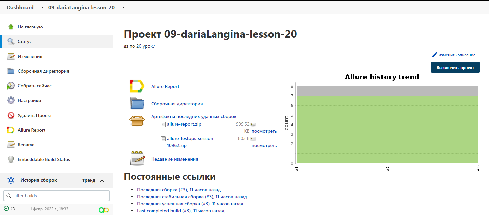
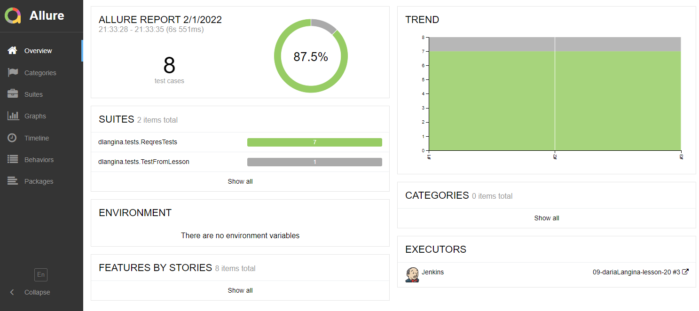
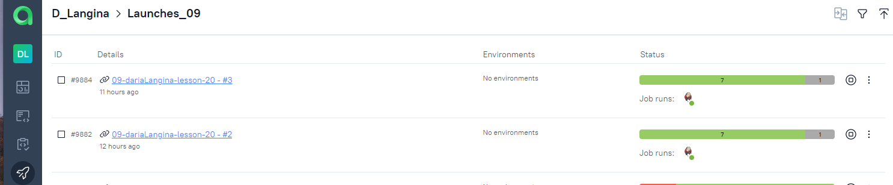
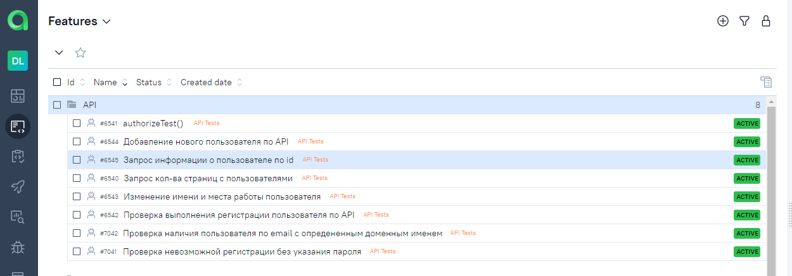
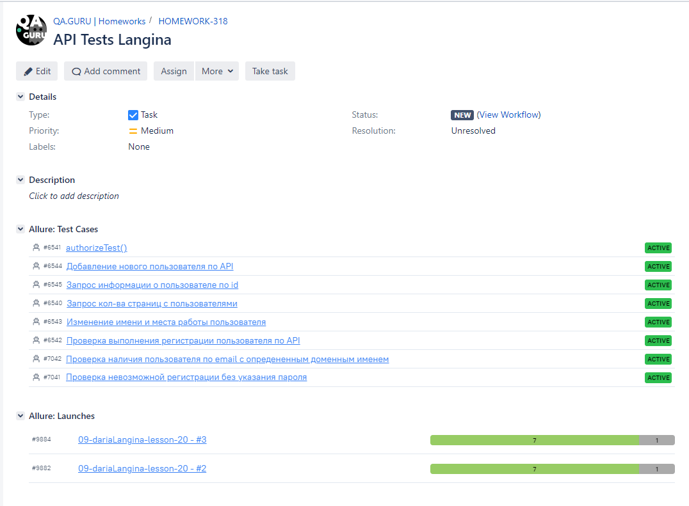
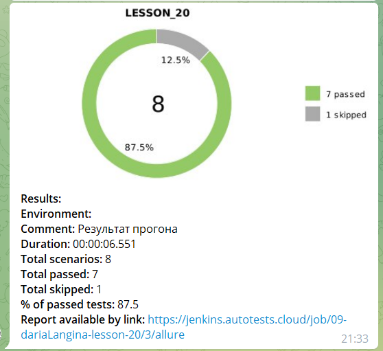

<h1 align="center"> :robot: Проект по автоматизации тестирования в рамках обучения на курсе QA.GURU </h1>

## :rocket: Технологический стек

IntelliJ IDEA, Java, Gradle, JUnit5, Selenide, Jenkins, Allure Report, Allure TestOps,
Jira, Github, Telegram

<p  align="center"

<code></code>
<code></code>
<code></code>
<code></code>
<code></code>
<code></code>
<code></code>
<code></code>
<code></code>
<code></code>
<code></code>
</p>

## API тесты

* ✅ Запрос информации о пользователе по id
* ✅ Запрос кол-ва страниц с пользователями
* ✅ Добавление нового пользователя по API
* ✅ Изменение имени и места работы пользователя
* ✅ Проверка выполнения регистрации пользователя по API
* ✅ Проверка невозможности регистрации без указания пароля
* ✅ Проверка наличия пользователя по email с опредененным доменным именем

Serve report:

```bash
allure serve build/allure-results
```

### Запуск в Jenkins

Статистика по запускам <br >
<p align="center">
  
</p>

### Отчёт о прохождении автотестов в Allure Report

<p align="center">
  
</p>

### Хранение тестовой документации в Allure TestOps

<p align="center">
  
</p>

<p align="center">
  
</p>

### Интерграция с Jira

<p align="center">
  
</p>

### Уведомления о прохождении автотестов в Telegram

<p align="center">
  
</p>

### Как запустить

### Локально

```
gradle clean test
```

### Удаленно

```
gradle clean test
```

:heart: <a target="_blank" href="https://qa.guru">qa.guru</a><br/>
:blue_heart: <a target="_blank" href="https://t.me/qa_automation">t.me/qa_automation</a>
